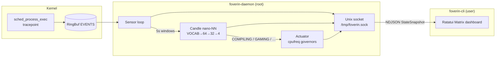

# Foverin

**Autonomous Linux workload optimizer.**  
eBPF senses process activity → a tiny Candle neural net classifies it → a cpufreq actuator sets the right CPU governor. A Matrix-style TUI attaches over a Unix socket whenever you want eyes on the loop.

[](https://github.com/hocestnonsatis/foverin/actions/workflows/rust.yml)
[](LICENSE)

> Requires **root** for the daemon (eBPF + cpufreq). The CLI runs as a normal user.

---

## Architecture



| Component | Role |
| --- | --- |
| `foverin-ebpf` | BPF program on `sched:sched_process_exec` |
| `foverin-daemon` | Sensor + inference + actuator + UDS server |
| `foverin-cli` | Unprivileged Ratatui client |
| `forge` | Offline trainer → `foverin_weights.safetensors` |
| `foverin-common` | Shared `ProcessEvent` + serializable `StateSnapshot` |

---

## Why “Foverin”?

The prototype lived under the working title **Panopticon** — Bentham’s all-seeing prison, a blunt metaphor for system-wide observation. For the public brand we wanted something that kept the *foresight* without the dystopia.

**Foverin** is a coined name: *fore-* (ahead, before contention) blended into a compact, pronounceable word. It is the daemon that watches the machine’s near future — compile storms, game sessions, idle drift — and acts a few seconds early so background apps do not steal your L3 and CPU cycles.

---

## How it works

1. **Sense** — An Aya eBPF program attaches to `sched_process_exec` and streams `ProcessEvent { pid, filename }` into a RingBuf.
2. **Aggregate** — Every 5 seconds the daemon multi-hot-encodes process basenames against a fixed Linux vocabulary.
3. **Classify** — A custom Candle feed-forward net (`VOCAB → 64 → 32 → 4`) runs Softmax → `argmax` → one of `COMPILING | GAMING | BROWSING | IDLE` plus a confidence %. Empty windows short-circuit to `IDLE` @ 100% (no forward pass).
4. **Actuate** — Under `COMPILING` / `GAMING`: all CPUs → `performance`. Under `BROWSING` / `IDLE`: efficiency governor (`schedutil`, else `powersave`).
5. **Observe** — `StateSnapshot` JSON is broadcast on `/tmp/foverin.sock`. `foverin-cli` paints the Matrix TUI; quitting the CLI does **not** stop the daemon.

| Workload | Governor |
| --- | --- |
| `COMPILING` / `GAMING` | `performance` |
| `BROWSING` / `IDLE` | `schedutil` (else `powersave`) |

---

## Installation

### Dependencies (CachyOS / Arch)

```bash
sudo pacman -S --needed base-devel rustup llvm clang
# Nightly is required for the eBPF crate (build-std).
rustup toolchain install nightly
rustup +nightly component add rust-src
cargo install bpf-linker
```

Also ensure a writable cpufreq sysfs (`scaling_governor`).

### Build from source

```bash
git clone https://github.com/hocestnonsatis/foverin.git
cd foverin

# Train (or use a release asset’s weights)
cargo build --release --bin forge
./target/release/forge
# → foverin_weights.safetensors (~22 KB)

# Daemon + CLI
cargo build --release --bin foverin-daemon --bin foverin-cli
```

### Run

```bash
# Terminal A — silent optimizer (root)
sudo -E ./target/release/foverin-daemon

# Terminal B — dashboard (no sudo)
./target/release/foverin-cli
```

Override weights: `FOVERIN_WEIGHTS=/path/to/file.safetensors`.

Socket: `/tmp/foverin.sock` (created mode `0666` so unprivileged clients can connect — see [SECURITY.md](SECURITY.md)).

### Systemd

```bash
sudo install -Dm755 target/release/foverin-daemon /usr/local/bin/foverin-daemon
sudo install -Dm755 target/release/foverin-cli    /usr/local/bin/foverin-cli
sudo install -Dm644 foverin_weights.safetensors \
  /usr/local/share/foverin/foverin_weights.safetensors
sudo install -Dm644 foverin.service /etc/systemd/system/foverin.service

sudo systemctl daemon-reload
sudo systemctl enable --now foverin.service
foverin-cli   # attach anytime
```

### Prebuilt releases

GitHub Releases (`v*` tags) ship `x86_64-unknown-linux-gnu` binaries plus `foverin_weights.safetensors`. Prefer building from source if your kernel/toolchain differs.

---

## TUI

| Pane | Content |
| --- | --- |
| Left | **eBPF SENSOR STREAM** — last ~50 execs |
| Top right | **NANO-NN INFERENCE** — workload, confidence, latency |
| Bottom right | **SYSFS ACTUATOR** — active CPU governor |

If the daemon is down: `[ FATAL ]: FOVERIN DAEMON NOT REACHABLE`.

Keys: `q` / `Esc` / `Ctrl+C` quit the CLI only.

---

## Development

```bash
# Format / lint (userspace; skips BPF object)
FOVERIN_SKIP_EBPF=1 cargo fmt --all -- --check
FOVERIN_SKIP_EBPF=1 cargo clippy -p foverin-common -p foverin --all-targets -- -D warnings
FOVERIN_SKIP_EBPF=1 cargo check -p foverin-common --all-features
FOVERIN_SKIP_EBPF=1 cargo check -p foverin --lib --bin foverin-cli --bin forge
```

See [CONTRIBUTING.md](CONTRIBUTING.md) and [CODE_OF_CONDUCT.md](.github/CODE_OF_CONDUCT.md).

---

## Security

Foverin is a **privileged** control plane. Read [SECURITY.md](SECURITY.md) before deploying.

---

## License

Dual-licensed under **MIT** OR **Apache-2.0**. See [LICENSE](LICENSE), [LICENSE-MIT](LICENSE-MIT), and [LICENSE-APACHE](LICENSE-APACHE).

---

## Crucible checklist

1. `./target/release/forge` — high probe accuracy.  
2. `sudo -E ./target/release/foverin-daemon &`  
3. `./target/release/foverin-cli` — live Matrix uplink.  
4. Quit the TUI; confirm the daemon keeps actuating.  
5. Under compile load: `cat /sys/devices/system/cpu/cpu0/cpufreq/scaling_governor` → `performance`
