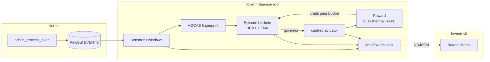

# Foverin

**Your CPU does not know what you are doing. Foverin does.**

eBPF watches every `exec`. Fingerprints land in episodic memory. UCB picks a cpufreq governor. The next window’s reward teaches the bucket. Matrix TUI optional — the loop never sleeps.

[](https://github.com/hocestnonsatis/foverin/actions/workflows/rust.yml)
[](LICENSE)

```
sense → fingerprint → decide → actuate → credit
eBPF     VOCAB bitset   UCB1     cpufreq    EMA reward
```

> **Root required** for the daemon (eBPF + sysfs). The CLI is unprivileged.

---

## Architecture



| Piece | Role |
| --- | --- |
| `foverin-ebpf` | Tracepoint → RingBuf |
| `foverin` / daemon | Sense · fingerprint · UCB decide · actuate · reward · persist |
| `foverin-cli` | Unprivileged Matrix uplink |
| `foverin-common` | `ProcessEvent` + `StateSnapshot` |

No offline trainer. No neural weights. Policy lives in `foverin_memory.json`.

---

## The loop

1. **Sense** — Aya eBPF on `sched_process_exec` streams `{ pid, filename }` into a RingBuf.
2. **Fingerprint** — Every 5s, multi-hot-encode basenames against a fixed Linux VOCAB → `u64` bitset bucket key.
3. **Decide** — Per-bucket UCB1 chooses among available governors (`performance` / `schedutil` / `powersave` / …). Cold buckets get heuristic priors (compile/game → performance bias).
4. **Actuate** — Write the chosen governor to all CPUs via sysfs.
5. **Credit** — Next window samples busy (`/proc/stat`), thermal, optional RAPL → balanced reward → EMA update on the prior `(bucket, governor)`. Cap 4096 buckets; LRU/low-visit eviction.
6. **Observe** — Soft labels (`COMPILING` / `GAMING` / `BROWSING` / `IDLE`) are UI-only. Decisions are governors. Snapshot NDJSON on `/tmp/foverin.sock`.

```
reward ≈ 0.45·align + 0.35·(1 − power_pen) + 0.20·(1 − thermal_pen)
```

Persist every ~12 ticks and on clean shutdown. Override path: `FOVERIN_MEMORY`.

---

## Install

### Dependencies (CachyOS / Arch)

```bash
sudo pacman -S --needed base-devel rustup llvm clang
rustup toolchain install nightly
rustup +nightly component add rust-src
cargo install bpf-linker
```

Nightly is required for the eBPF crate (`build-std`). cpufreq sysfs must be writable (`scaling_governor`).

### Build

```bash
git clone https://github.com/hocestnonsatis/foverin.git
cd foverin
cargo build --release --bin foverin-daemon --bin foverin-cli
```

### Run

```bash
# Terminal A — silent optimizer (root)
sudo -E ./target/release/foverin-daemon

# Terminal B — dashboard (no sudo)
./target/release/foverin-cli
```

| Knob | Default |
| --- | --- |
| Memory file | `foverin_memory.json` (CWD, else beside the binary) |
| Override | `FOVERIN_MEMORY=/path/to/foverin_memory.json` |
| Socket | `/tmp/foverin.sock` (`0666` — see [SECURITY.md](SECURITY.md)) |

### Systemd

```bash
sudo install -Dm755 target/release/foverin-daemon /usr/local/bin/foverin-daemon
sudo install -Dm755 target/release/foverin-cli    /usr/local/bin/foverin-cli
sudo mkdir -p /var/lib/foverin
sudo install -Dm644 foverin.service /etc/systemd/system/foverin.service

sudo systemctl daemon-reload
sudo systemctl enable --now foverin.service
foverin-cli   # attach anytime
```

Unit sets `FOVERIN_MEMORY=/var/lib/foverin/foverin_memory.json`.

### Prebuilt

GitHub Releases (`v*` tags) ship `x86_64-unknown-linux-gnu` binaries. Prefer source if your kernel/toolchain differs.

---

## TUI

| Pane | Live feed |
| --- | --- |
| Left | **eBPF SENSOR STREAM** — last ~50 execs |
| Top right | **MEMORY POLICY** — soft class, confidence, decide latency |
| Bottom right | **SYSFS ACTUATOR** — active governor |

Daemon down → `[ FATAL ]: FOVERIN DAEMON NOT REACHABLE`  
Keys: `q` / `Esc` / `Ctrl+C` — CLI only; daemon stays up.

---

## Development

```bash
FOVERIN_SKIP_EBPF=1 cargo fmt --all -- --check
FOVERIN_SKIP_EBPF=1 cargo clippy -p foverin-common -p foverin --all-targets -- -D warnings
FOVERIN_SKIP_EBPF=1 cargo check -p foverin-common --all-features
FOVERIN_SKIP_EBPF=1 cargo check -p foverin --lib --bin foverin-cli --bin foverin-daemon
FOVERIN_SKIP_EBPF=1 cargo test -p foverin --lib
```

| Path | Purpose |
| --- | --- |
| `foverin/src/brain.rs` | VOCAB, fingerprint, soft label, `PolicyEngine` |
| `foverin/src/memory.rs` | Buckets, UCB1, EMA, JSON persist |
| `foverin/src/reward.rs` | Busy / thermal / RAPL → balanced score |
| `foverin/src/actuator.rs` | `scaling_governor` writes |
| `foverin-ebpf/` | BPF program |

See [CONTRIBUTING.md](CONTRIBUTING.md) and [CODE_OF_CONDUCT.md](.github/CODE_OF_CONDUCT.md).

---

## Security

Privileged control plane. Read [SECURITY.md](SECURITY.md) before you deploy.

---

## License

**MIT** OR **Apache-2.0** — [LICENSE](LICENSE), [LICENSE-MIT](LICENSE-MIT), [LICENSE-APACHE](LICENSE-APACHE).

---

## Smoke test

1. `sudo -E ./target/release/foverin-daemon &`
2. `./target/release/foverin-cli` — live Matrix uplink
3. Quit TUI → daemon still actuating
4. After a few windows, `foverin_memory.json` appears / grows
5. Under sustained compile load the policy should lean `performance` once rewarded
