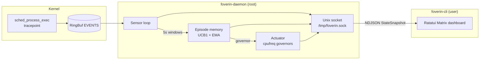

# Foverin

**Your CPU does not know what you are doing. Foverin does.**

eBPF watches every `exec`. An episodic memory policy learns which cpufreq governor pays off in each workload fingerprint. Matrix TUI optional — the loop never sleeps.

[](https://github.com/hocestnonsatis/foverin/actions/workflows/rust.yml)
[](LICENSE)

```
sense → remember → actuate → learn
eBPF     UCB memory   cpufreq      reward
```

> **Root required** for the daemon (eBPF + sysfs). The CLI is unprivileged.

---

## Architecture



| Crate | Job |
| --- | --- |
| `foverin-ebpf` | Tracepoint → RingBuf |
| `foverin-daemon` | Sense · remember · actuate · learn · broadcast |
| `foverin-cli` | Unprivileged Matrix uplink |
| `foverin-common` | Shared events + snapshots |

---

## The loop

1. **Sense** — Aya eBPF on `sched_process_exec` streams `ProcessEvent { pid, filename }` into a RingBuf.
2. **Aggregate** — Every 5s, multi-hot-encode process basenames against a fixed Linux vocabulary → fingerprint.
3. **Decide** — Bucket lookup + UCB1 picks `performance` / `schedutil` / `powersave` (whatever the kernel exposes). Soft labels (`COMPILING` / …) are UI-only.
4. **Actuate** — Write the chosen governor to all CPUs.
5. **Learn** — Next window’s busy / thermal / (optional RAPL) metrics become a balanced reward; EMA updates that bucket. Persist to `foverin_memory.json`.
6. **Observe** — `StateSnapshot` NDJSON on `/tmp/foverin.sock`. Quit the TUI; the daemon keeps running.

No offline trainer. No safetensors. Cold-start uses heuristic priors; the machine teaches the rest.

---

## Install

### Dependencies (CachyOS / Arch)

```bash
sudo pacman -S --needed base-devel rustup llvm clang
rustup toolchain install nightly
rustup +nightly component add rust-src
cargo install bpf-linker
```

Nightly is required for the eBPF crate (`build-std`). cpufreq sysfs must be writable (`scaling_governor`).

### Build

```bash
git clone https://github.com/hocestnonsatis/foverin.git
cd foverin

cargo build --release --bin foverin-daemon --bin foverin-cli
```

### Run

```bash
# Terminal A — silent optimizer (root)
sudo -E ./target/release/foverin-daemon

# Terminal B — dashboard (no sudo)
./target/release/foverin-cli
```

Memory override: `FOVERIN_MEMORY=/path/to/foverin_memory.json`  
Socket: `/tmp/foverin.sock` (mode `0666` — see [SECURITY.md](SECURITY.md))

### Systemd

```bash
sudo install -Dm755 target/release/foverin-daemon /usr/local/bin/foverin-daemon
sudo install -Dm755 target/release/foverin-cli    /usr/local/bin/foverin-cli
sudo mkdir -p /var/lib/foverin
sudo install -Dm644 foverin.service /etc/systemd/system/foverin.service

sudo systemctl daemon-reload
sudo systemctl enable --now foverin.service
foverin-cli   # attach anytime
```

### Prebuilt

GitHub Releases (`v*` tags) ship `x86_64-unknown-linux-gnu` binaries. Prefer source if your kernel/toolchain differs.

---

## TUI

| Pane | Live feed |
| --- | --- |
| Left | **eBPF SENSOR STREAM** — last ~50 execs |
| Top right | **MEMORY POLICY** — soft class, confidence, latency |
| Bottom right | **SYSFS ACTUATOR** — active governor |

Daemon down → `[ FATAL ]: FOVERIN DAEMON NOT REACHABLE`  
Keys: `q` / `Esc` / `Ctrl+C` — CLI only; daemon stays up.

---

## Development

```bash
FOVERIN_SKIP_EBPF=1 cargo fmt --all -- --check
FOVERIN_SKIP_EBPF=1 cargo clippy -p foverin-common -p foverin --all-targets -- -D warnings
FOVERIN_SKIP_EBPF=1 cargo check -p foverin-common --all-features
FOVERIN_SKIP_EBPF=1 cargo check -p foverin --lib --bin foverin-cli --bin foverin-daemon
FOVERIN_SKIP_EBPF=1 cargo test -p foverin --lib
```

See [CONTRIBUTING.md](CONTRIBUTING.md) and [CODE_OF_CONDUCT.md](.github/CODE_OF_CONDUCT.md).

---

## Security

Privileged control plane. Read [SECURITY.md](SECURITY.md) before you deploy.

---

## License

**MIT** OR **Apache-2.0** — [LICENSE](LICENSE), [LICENSE-MIT](LICENSE-MIT), [LICENSE-APACHE](LICENSE-APACHE).

---

## Smoke test

1. `sudo -E ./target/release/foverin-daemon &`  
2. `./target/release/foverin-cli` — live Matrix uplink  
3. Quit TUI → daemon still actuating  
4. After a few windows, `foverin_memory.json` grows  
5. Under sustained compile load the policy should prefer `performance` once rewarded
