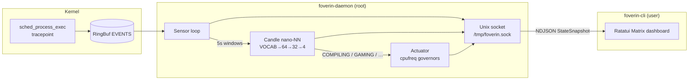

# Foverin

**Your CPU does not know what you are doing. Foverin does.**

eBPF watches every `exec`. A nano neural net classifies the workload in 5s windows. A cpufreq actuator flips governors before the storm hits. Matrix TUI optional — the loop never sleeps.

[](https://github.com/hocestnonsatis/foverin/actions/workflows/rust.yml)
[](LICENSE)

```
sense → classify → actuate → (watch)
eBPF     Candle NN   cpufreq      Ratatui
```

> **Root required** for the daemon (eBPF + sysfs). The CLI is unprivileged.

---

## Architecture



| Crate | Job |
| --- | --- |
| `foverin-ebpf` | Tracepoint → RingBuf |
| `foverin-daemon` | Sense · infer · actuate · broadcast |
| `foverin-cli` | Unprivileged Matrix uplink |
| `forge` | Offline trainer → `foverin_weights.safetensors` |
| `foverin-common` | Shared events + snapshots |

---

## The loop

1. **Sense** — Aya eBPF on `sched_process_exec` streams `ProcessEvent { pid, filename }` into a RingBuf.
2. **Aggregate** — Every 5s, multi-hot-encode process basenames against a fixed Linux vocabulary.
3. **Classify** — Candle feed-forward (`VOCAB → 64 → 32 → 4`) → Softmax → `argmax` → `COMPILING | GAMING | BROWSING | IDLE` + confidence. Empty window → `IDLE` @ 100% (no forward pass).
4. **Actuate** — Hot workloads pin `performance`. Quiet ones drop to `schedutil` (else `powersave`).
5. **Observe** — `StateSnapshot` NDJSON on `/tmp/foverin.sock`. Quit the TUI; the daemon keeps running.

| Workload | Governor |
| --- | --- |
| `COMPILING` / `GAMING` | `performance` |
| `BROWSING` / `IDLE` | `schedutil` → `powersave` |

---

## Install

### Dependencies (CachyOS / Arch)

```bash
sudo pacman -S --needed base-devel rustup llvm clang
rustup toolchain install nightly
rustup +nightly component add rust-src
cargo install bpf-linker
```

Nightly is required for the eBPF crate (`build-std`). cpufreq sysfs must be writable (`scaling_governor`).

### Build

```bash
git clone https://github.com/hocestnonsatis/foverin.git
cd foverin

cargo build --release --bin forge
./target/release/forge
# → foverin_weights.safetensors (~22 KB)

cargo build --release --bin foverin-daemon --bin foverin-cli
```

### Run

```bash
# Terminal A — silent optimizer (root)
sudo -E ./target/release/foverin-daemon

# Terminal B — dashboard (no sudo)
./target/release/foverin-cli
```

Weights override: `FOVERIN_WEIGHTS=/path/to/file.safetensors`  
Socket: `/tmp/foverin.sock` (mode `0666` — see [SECURITY.md](SECURITY.md))

### Systemd

```bash
sudo install -Dm755 target/release/foverin-daemon /usr/local/bin/foverin-daemon
sudo install -Dm755 target/release/foverin-cli    /usr/local/bin/foverin-cli
sudo install -Dm644 foverin_weights.safetensors \
  /usr/local/share/foverin/foverin_weights.safetensors
sudo install -Dm644 foverin.service /etc/systemd/system/foverin.service

sudo systemctl daemon-reload
sudo systemctl enable --now foverin.service
foverin-cli   # attach anytime
```

### Prebuilt

GitHub Releases (`v*` tags) ship `x86_64-unknown-linux-gnu` binaries + weights. Prefer source if your kernel/toolchain differs.

---

## TUI

| Pane | Live feed |
| --- | --- |
| Left | **eBPF SENSOR STREAM** — last ~50 execs |
| Top right | **NANO-NN INFERENCE** — class, confidence, latency |
| Bottom right | **SYSFS ACTUATOR** — active governor |

Daemon down → `[ FATAL ]: FOVERIN DAEMON NOT REACHABLE`  
Keys: `q` / `Esc` / `Ctrl+C` — CLI only; daemon stays up.

---

## Development

```bash
FOVERIN_SKIP_EBPF=1 cargo fmt --all -- --check
FOVERIN_SKIP_EBPF=1 cargo clippy -p foverin-common -p foverin --all-targets -- -D warnings
FOVERIN_SKIP_EBPF=1 cargo check -p foverin-common --all-features
FOVERIN_SKIP_EBPF=1 cargo check -p foverin --lib --bin foverin-cli --bin forge
```

See [CONTRIBUTING.md](CONTRIBUTING.md) and [CODE_OF_CONDUCT.md](.github/CODE_OF_CONDUCT.md).

---

## Security

Privileged control plane. Read [SECURITY.md](SECURITY.md) before you deploy.

---

## License

**MIT** OR **Apache-2.0** — [LICENSE](LICENSE), [LICENSE-MIT](LICENSE-MIT), [LICENSE-APACHE](LICENSE-APACHE).

---

## Smoke test

1. `./target/release/forge` — high probe accuracy  
2. `sudo -E ./target/release/foverin-daemon &`  
3. `./target/release/foverin-cli` — live Matrix uplink  
4. Quit TUI → daemon still actuating  
5. Under compile load: `cat /sys/devices/system/cpu/cpu0/cpufreq/scaling_governor` → `performance`
